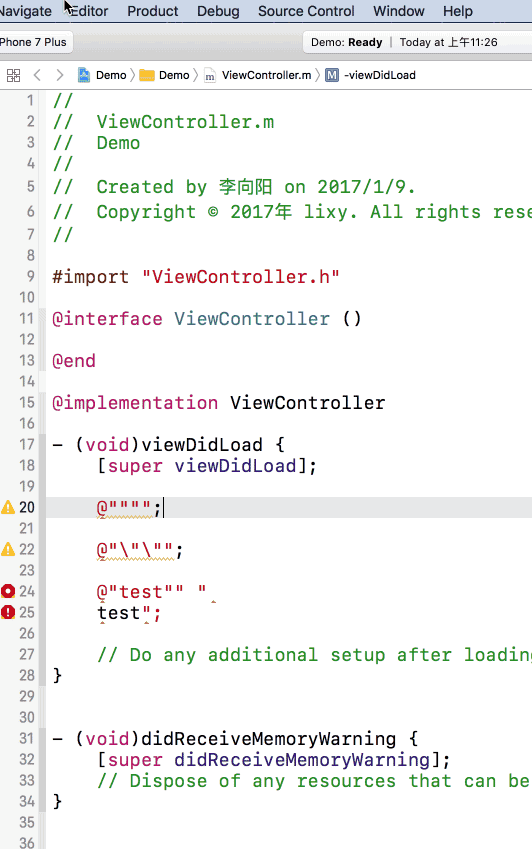

# Introduction
(Un)Escape String (Xcode8 Editor Extension)
 
快速转义/反转义字符串
 
 

#Install
(OSX 10.11 only) sudo /usr/libexec/xpccachectl 
Download, unzip and run <a href ="https://github.com/keepyounger/Escape/blob/master/Escape.zip?raw=true"> Escape </a> 
 -> System Preferences... -> Extensions -> All -> Enable Escape 
You can set a shortcut (Key-Binding) for Escape using Xcode. 
Xcode -> Preferences... -> Key Bindings (Filter "Escape") 

在OSX 10.11 上 需要先执行Command: sudo /usr/libexec/xpccachectl 
下载, 解压 并运行 <a href ="https://github.com/keepyounger/Escape/blob/master/Escape.zip?raw=true"> Escape </a> 
 -> 系统偏好设置...-> 扩展-> 全部 -> 勾选Escape 
你可以用Xcode设置快捷键。 
Xcode -> Preferences... -> Key Bindings (Filter "Escape") 

#Download
<a href ="https://github.com/keepyounger/Escape/blob/master/Escape.zip?raw=true"> Escape </a>  

# Support
Xcode 8 or later
# Thanks
<a href ="https://github.com/holtwick/HOStringSense-for-Xcode"> HOStringSense-for-Xcode </a>  

